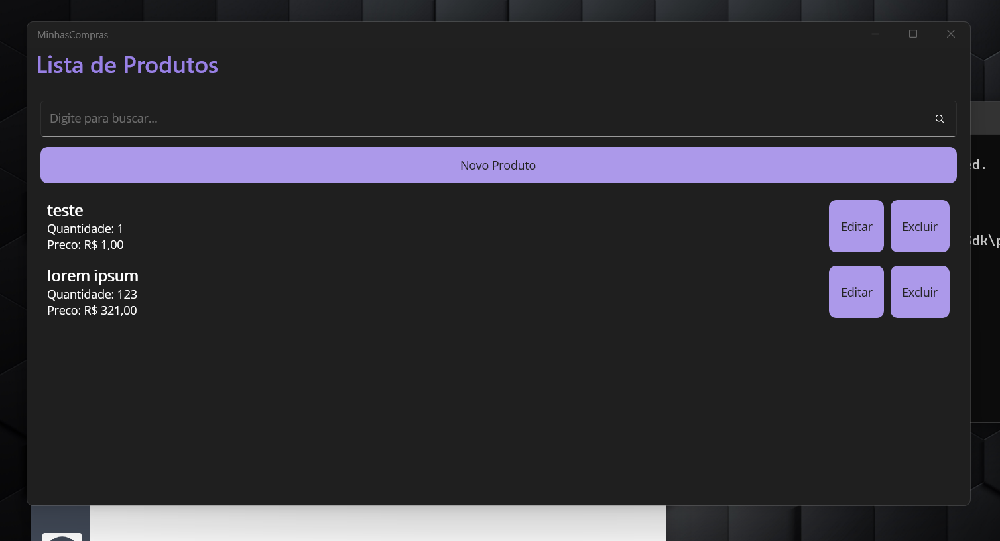
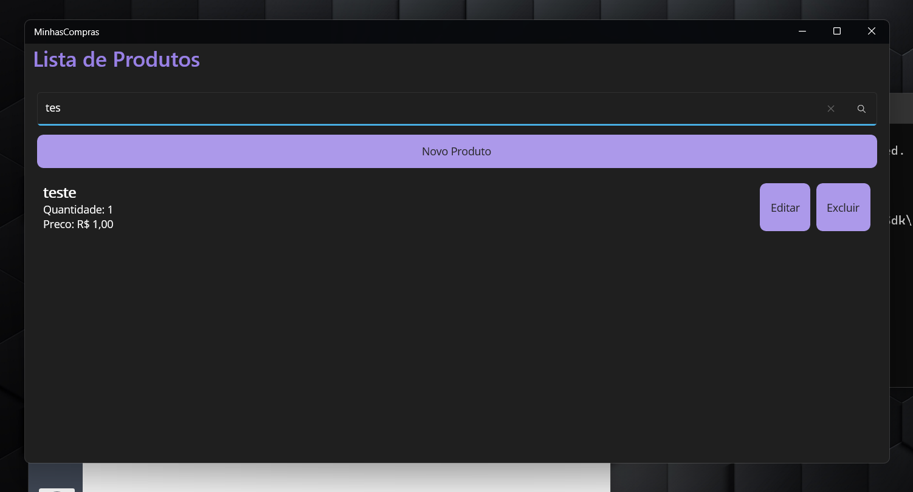

# MinhasCompras

App de lista de compras feito em .NET MAUI (net 8)





## O que o app faz

- Cadastra produtos (descrição, quantidade e preço)
- Lista os produtos salvos
- Edita e exclui produtos
- Busca em tempo real (digita e ja filtra a lista)
- Salva tudo em um banco SQLite local (arquivo Dados.db dentro da pasta ArquivoDados)

## Como rodar no Windows

O jeito que funcionou pra mim foi rodar pelo terminal usando <code>powershell -ExecutionPolicy Bypass -File .\deploy_app.ps1</code> (DeepSeek me ajudou a descobrir isso, antes não rodava por nada)

```powershell
powershell -ExecutionPolicy Bypass -File .\deploy_app.ps1
```

Esse script compila o app, registra o pacote MSIX e abre a janela do app

Nao usei `dotnet run` nem `dotnet build -t:Run` porque eles rodavam o exe solto e o app fechava sozinho com erro de classe nao registrada (o Windows App SDK precisa rodar como pacote)

## Arquivos importantes

### global.json
Forca o uso do .NET 8 no projeto, sem ele a maquina nao achava o net 8 e dava erro

### Properties/launchSettings.json
Define o perfil WindowsMachine pra rodar no Windows

### MinhasCompras.csproj
Só deixei o alvo net8.0-windows10.0.19041.0 (antes estava duplicado e dava erro)

### deploy_app.ps1
Script que monta o pacote MSIX e abre o app no Windows

### MauiProgram.cs e App.xaml.cs
Coloquei um log simples (arquivo minhascompras.log) pra descobrir por que o app fechava sozinho, ai vi que o problema era o exe solto sem pacote

### ArquivoDados/
Pasta na raiz do projeto onde fica o arquivo Dados.db (banco SQLite), assim o banco fica visivel dentro do projeto e nao escondido no pacote MSIX

## Onde fica o banco de dados

O arquivo Dados.db fica na pasta `ArquivoDados` na raiz do projeto

```
MinhasCompras/
  ArquivoDados/
    Dados.db   <-- banco SQLite com os produtos cadastrados
```

Antes o banco ficava escondido dentro da pasta do pacote MSIX em `AppData\Local\Packages\...`, ai era dificil achar, agora fica facil dentro do projeto

Da pra abrir o Dados.db com o programa [DB Browser for SQLite](https://sqlitebrowser.org/) pra ver os produtos cadastrados

## O que eu tive que arrumar

1. O global.json e o launchSettings.json coloquei comentario com `//` no meio do JSON, e JSON nao aceita comentario (descobri depois), entao removi
2. O csproj tinha o TargetFrameworks duplicado (adicionava net8.0-windows10.0.19041.0 duas vezes), deixei só um
3. Faltava a carga de trabalho maui-tizen, rodei `dotnet workload restore`
4. Deu erro NETSDK1112 (pacote do Windows SDK nao baixado), rodei `dotnet restore -r any`
5. O app abria e fechava em 15 segundos sem erro visivel, descobri pelo DeepSeek mandando o log que o problema era rodar o exe solto em vez do pacote MSIX
6. Criei o deploy_app.ps1 que DeepSeek mandou que registra o AppX e abre o app pelo AUMID para funcionar
7. O banco Dados.db ficava escondido dentro da pasta do pacote MSIX, criei a pasta ArquivoDados na raiz do projeto e mudei o App.xaml.cs pra salvar o banco la dentro, agora da pra ver e abrir o banco facil
8. Coloquei uma barra de busca em cima da lista, enquanto digita ela filtra os produtos pelo nome no banco SQLite, se apagar o texto volta a lista toda

## Busca em tempo real

Na tela principal tem uma barra de busca em cima do botao Novo

- Digita o nome do produto e a lista filtra sozinha
- A consulta usa LIKE no campo Descricao la no SQLite
- Se apagar o texto a lista volta a mostrar tudo
- Usei ObservableCollection pra a lista atualizar sozinha quando muda

## Comandos uteis

```powershell
# restaurar cargas de trabalho do MAUI
dotnet workload restore

# restaurar pacotes do Windows SDK
dotnet restore -r any

# compilar o projeto
dotnet build -f net8.0-windows10.0.19041.0

# abrir o app no Windows (o jeito que funciona)
powershell -ExecutionPolicy Bypass -File .\deploy_app.ps1
```
